# microCLIP: Unsupervised CLIP Adaptation via Coarse–Fine Token Fusion for Fine-Grained Image Classification

[](https://arxiv.org/abs/2510.02270)
[](https://github.com/sathiiii/microCLIP)


---

## Authors
**Sathira Silva $^1$** · **Eman Ali $^{1,2}$** · **Chetan Arora $^3$** · **Muhammad Haris Khan $^1$**  
$^1$<sub>Mohamed Bin Zayed University of Artificial Intelligence</sub> · $^2$<sub>Alexandria University</sub> · $^3$<sub>IIT Delhi</sub>

---

## Abstract

Unsupervised adaptation of CLIP-based vision-language models (VLMs) for fine-grained image classification requires sensitivity to microscopic local cues. While CLIP exhibits strong zero-shot transfer, its reliance on coarse global features restricts its performance on fine-grained classification tasks. Prior efforts inject fine-grained knowledge by aligning large language model (LLM) descriptions with the CLIP $\texttt{[CLS]}$ token; however, this approach overlooks spatial precision. We propose $\textbf{microCLIP}$, a self-training framework that jointly refines CLIP's visual and textual representations using fine-grained cues. At its core is Saliency-Oriented Attention Pooling (SOAP) within a lightweight TokenFusion module, which builds a saliency-guided $\texttt{[FG]}$ token from patch embeddings and fuses it with the global $\texttt{[CLS]}$ token for coarse-fine alignment. To stabilize adaptation, we introduce a two-headed LLM-derived classifier: a frozen classifier that, via multi-view alignment, provides a stable text-based prior for pseudo-labeling, and a learnable classifier initialized from LLM descriptions and fine-tuned with TokenFusion. We further develop Dynamic Knowledge Aggregation, which convexly combines fixed LLM/CLIP priors with TokenFusion's evolving logits to iteratively refine pseudo-labels. Together, these components uncover latent fine-grained signals in CLIP, yielding a consistent $2.90\%$ average accuracy gain across 13 fine-grained benchmarks while requiring only light adaptation. Our code is available at [https://github.com/sathiiii/microCLIP](https://github.com/sathiiii/microCLIP).

---

## Overall Architecture
<p align="center">
  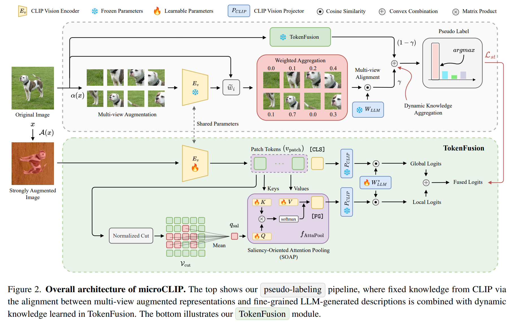
</p>

---

## Results

### Comparison to Zero-shot and UA Baselines
<p align="center">
  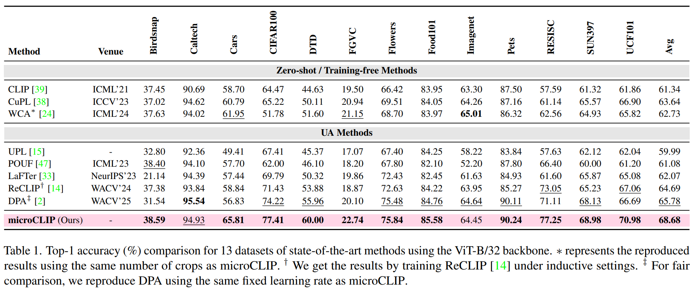
</p>

### Ablation Studies
**Effect of coarse vs fine-grained cues:**  
<p align="center">
  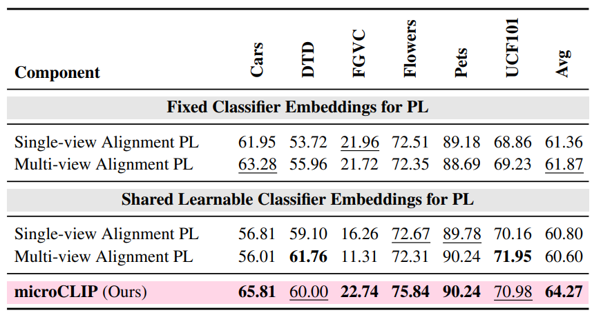
</p>

**Effect of SOAP:**  
<p align="center">
  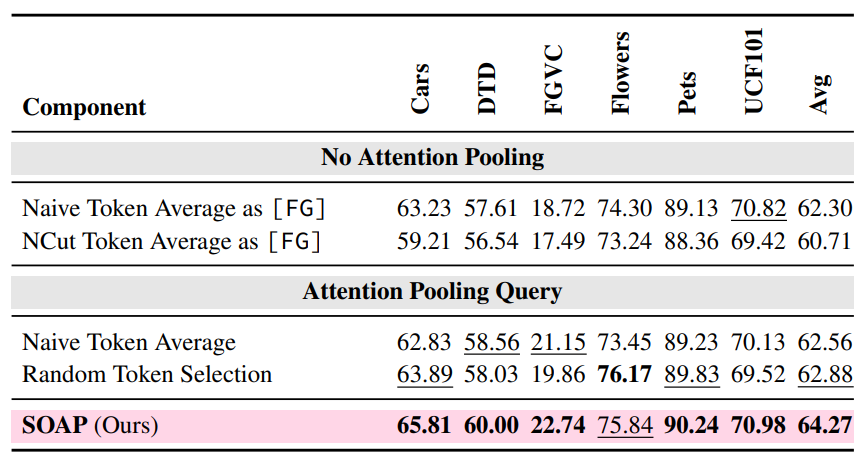
</p>

**Dynamic Knowledge Aggregation:**  
<p align="center">
  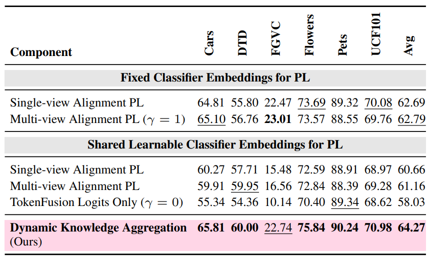
</p>

**Two-headed classifier initialization:**  
<p align="center">
  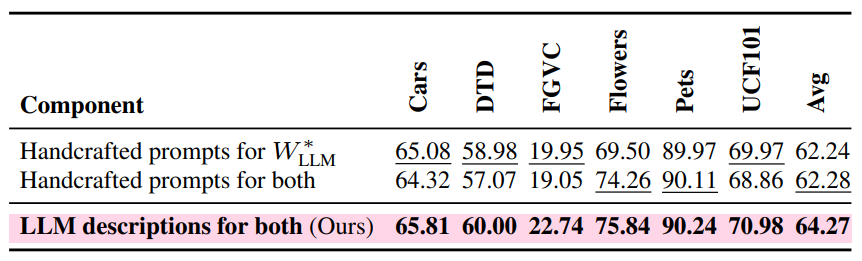
</p>

### Backbone Scaling
<p align="center">
  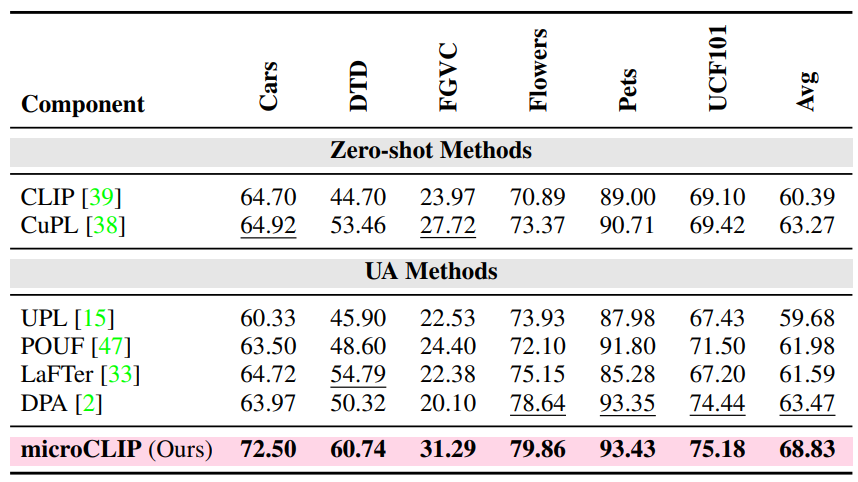
</p>

---

## Visualizations

**Sharper local attention via SOAP-guided [FG]:**  
<p align="center">
  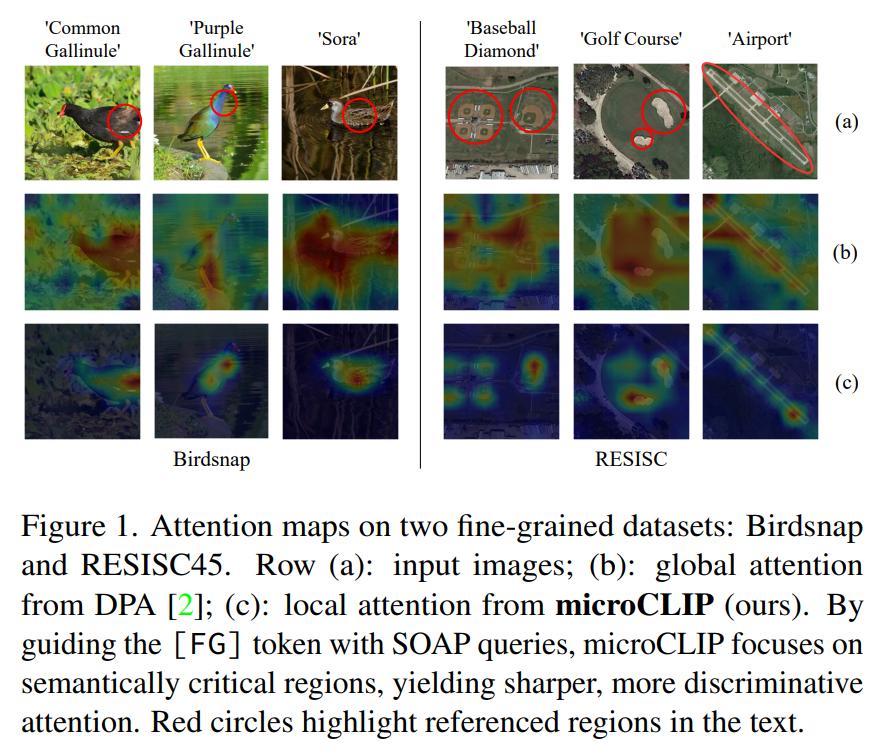
</p>

**[CLS] vs [FG] attention across datasets:**  
<p align="center">
  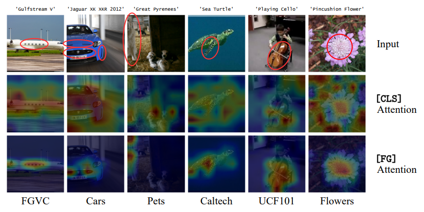
</p>

**Pseudo-label accuracy progression:**  
<p align="center">
  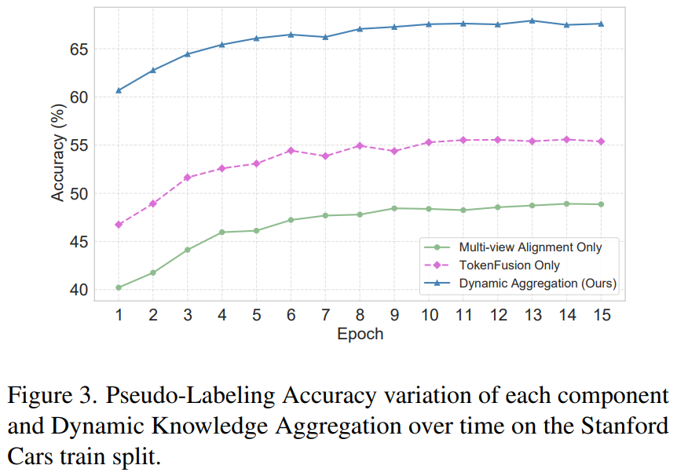
</p>

**NCut saliency masks:**  
<p align="center">
  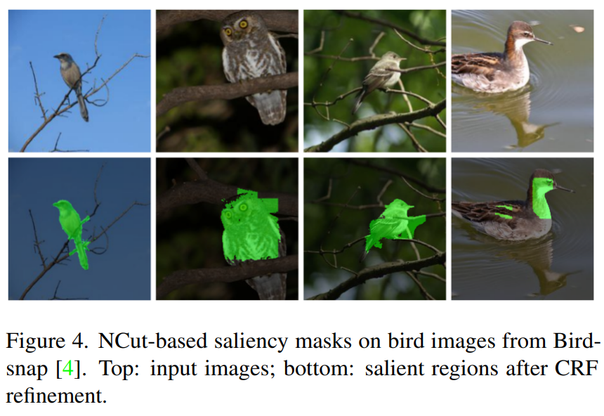
</p>

---

## Acknowledgements
This work builds upon the [MUST](https://github.com/salesforce/MUST) repository.  
We thank the authors of [MetaCLIP](https://github.com/facebookresearch/MetaCLIP) for releasing their codebase, which we use in additional experiments.  
We also acknowledge [CuPL](https://github.com/prattai/cupl) for providing GPT-3 generated class descriptions, included in [`all_prompts/`](./all_prompts).

---

## Citation
```bibtex
@misc{silva2025microclipunsupervisedclipadaptation,
      title={microCLIP: Unsupervised CLIP Adaptation via Coarse-Fine Token Fusion for Fine-Grained Image Classification}, 
      author={Sathira Silva and Eman Ali and Chetan Arora and Muhammad Haris Khan},
      year={2025},
      eprint={2510.02270},
      archivePrefix={arXiv},
      primaryClass={cs.CV},
      url={https://arxiv.org/abs/2510.02270}, 
}
```

<link rel="stylesheet" href="https://cdn.jsdelivr.net/npm/katex@0.16.9/dist/katex.min.css">
<script defer src="https://cdn.jsdelivr.net/npm/katex@0.16.9/dist/katex.min.js"></script>
<script defer src="https://cdn.jsdelivr.net/npm/katex@0.16.9/dist/contrib/auto-render.min.js"
        onload="renderMathInElement(document.body);"></script>
